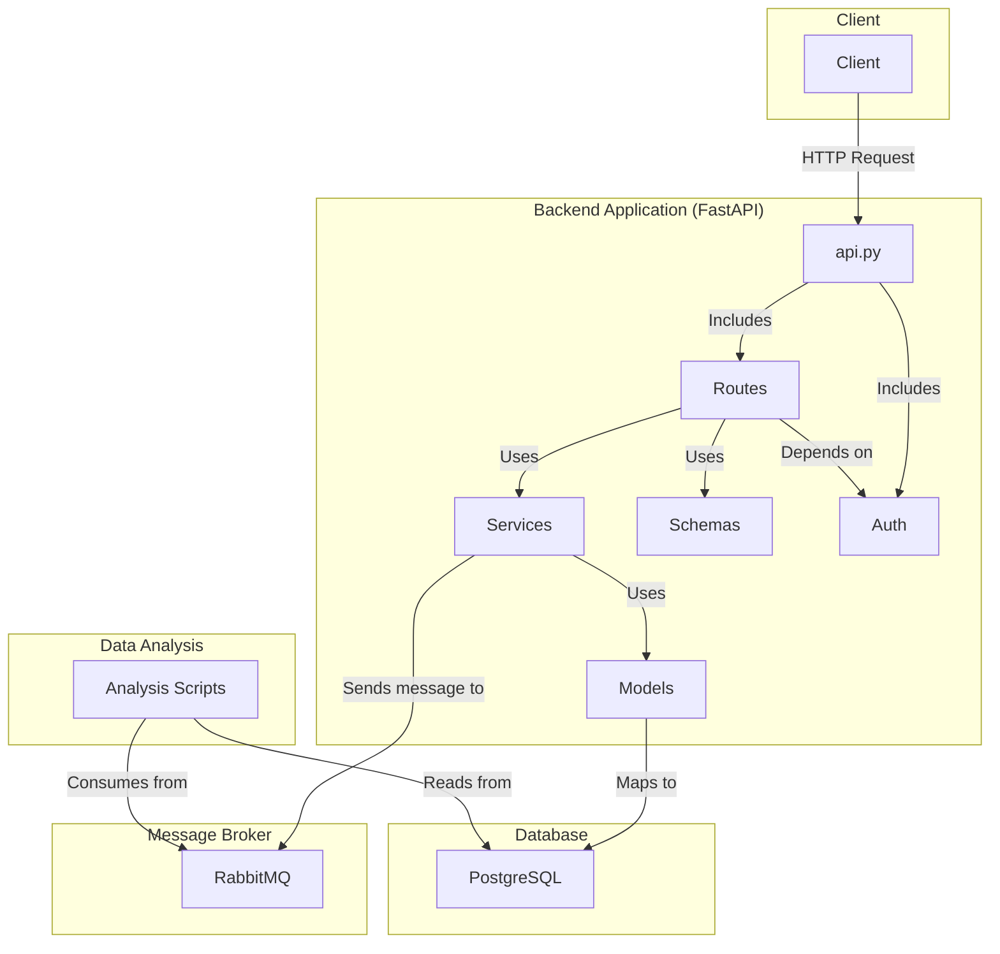

```mermaid
graph TD
    subgraph "Client"
        A[Client]
    end

    subgraph "Backend Application (FastAPI)"
        B[api.py]
        C[Routes]
        D[Services]
        E[Models]
        F[Schemas]
        G[Auth]
    end

    subgraph "Database"
        H[PostgreSQL]
    end

    subgraph "Message Broker"
        I[RabbitMQ]
    end

    subgraph "Data Analysis"
        J[Analysis Scripts]
    end

    A -- HTTP Request --> B
    B -- Includes --> C
    B -- Includes --> G
    C -- Uses --> D
    C -- Uses --> F
    C -- Depends on --> G
    D -- Uses --> E
    D -- Sends message to --> I
    E -- Maps to --> H
    J -- Consumes from --> I
    J -- Reads from --> H
```
